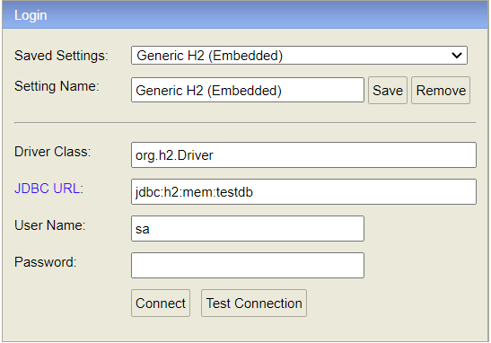
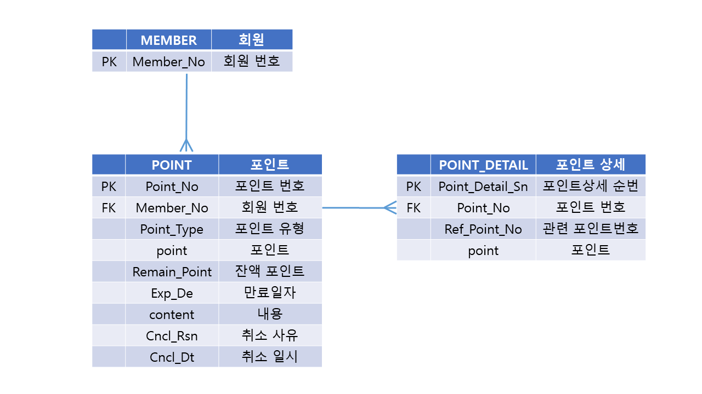
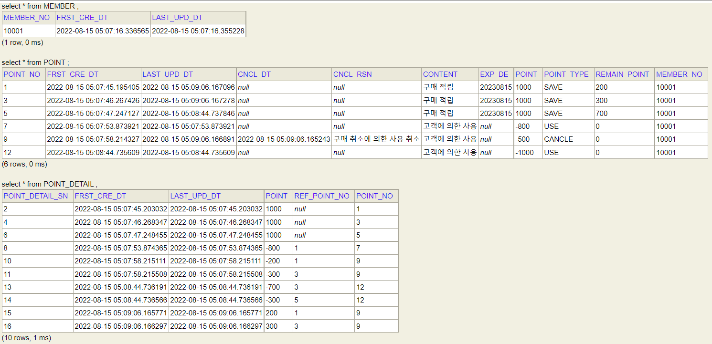

# README

## 개발과제 - 포인트 API 서버

---

### 📑목차

1. [개발 환경 및 기술 스택](#1-개발-환경-및-기술-스택)
2. [설치 및 빌드 방법](#2-설치-및-빌드-방법)
3. [설계 설명](#3-설계-설명) 
4. [API 구현 여부 및 설명](#4-API-구현-여부-및-설명) 
5. [테스트 시나리오 결과](#5-테스트-시나리오-결과) 
---

### 1. 개발 환경 및 기술 스택

- Java (open Jdk 17.0.2)
- Spring Boot 2.7.1
- Gradle
- JPA
- DB : H2 database
- JUnit
- 이클립스 IDE

---

### 2. 설치 및 빌드 방법

[1. Java 버전이 17이 아닐 경우 , 아래 진행]

1) sudo apt-get update

2) sudo apt install openjdk-17-jdk-headless

3) JAVA_HOME 등록:  vi /etc/profile → 하단에 export JAVA_HOME=/usr/lib/jvm/java-17-openjdk-amd64  입력 후 저장

[2. gradle 빌드 방법]

1) git clone https://github.com/RorNHJ/point-api-server.git

2) chmod 755 point-api-server/gradlew

3) cd point-api-server

4) ./gradlew clean build

5) java -jar build/libs/point-api-server-0.0.1-SNAPSHOT.jar

[3. 테스트 방법]

1) UnitTest.java  → 단위테스트 ( 각 API별 테스트 메소드 구현)

2) IntegrationTest.java → 통합테스트 ( 일련의 API 시나리오)

3) [http://localhost:8080/h2-console](http://localhost:8080/h2-console)  에서 아래 그림 처럼 입력

### 3. 설계 설명

 **1.  설계 내용**

- 설계
1. 테스트의 원활한 흐름을 위해서 회원번호를 입력하면 등록되는 API를 구현하였습니다.
2. 등록된 회원번호로 포인트를 적립 또는 사용할 수 있습니다.
3. 포인트유형은 크게 적립, 사용, 사용취소, 만료로 4가지  값이 있습니다.
4. 포인트 총 합계 계산 기준은 만료일자(사용기한)이 과거일자가 아닐 경우와 포인트 유형이 사용취소가 아니고 잔액포인트가 있을 경우의 모든 포인트 데이터의 잔액포인트 합계로 계산하였습니다.
5. 모든 API 호출 시, 회원번호가 등록되어 있지 않으면 500 에러처리하였습니다.
6. 포인트 적립은 포인트 테이블에 포인트 유형이 적립이고 만료일자가 1년뒤인 데이터가 하나 생기고, 포인트 상세 테이블에도 하나의 데이터가 생깁니다. 포인트 적립 순서는 포인트번호로 비교가 가능합니다.
7. 포인트 사용은 포인트 총 합계 계산 로직을 통해서 사용가능한 포인트를 조회 후 비교하여 차감이 가능한 금액인지 검사하여 마이너스 금액이 되는 것을 막도록 하였습니다.  검사가 통과되면포인트 테이블에 포인트 유형이 사용인 데이터가 하나 생깁니다. 그리고 사용할 포인트번호 조회 기준은 만료일자(사용기한)이 과거일자가 아닐 경우와 포인트 유형이 사용취소가 아니고 잔액포인트가 있을 경우의 모든 포인트 데이터를 포인트번호 순으로 조회 후, 잔액포인트만큼 차례대로 차감하며 그때마다 포인트 상세 테이블에 관련 포인트번호 필드에 차감된 포인트번호가 매핑이 되고 데이터가 하나씩 생깁니다.
8. 포인트 사용취소는 포인트 유형이 사용인 포인트 번호를 알고 있으면 취소가 가능합니다. 해당 포인트 번호의 관련 포인트 번호의 잔액포인트를 다시 그만큼 더해서 잔액을 복구시켜줍니다. 그리고 포인트 유형을 사용에서 사용취소로 업데이트해줍니다.
9. 포인트 적립/상세 내역 조회 시,  페이징처리를 하였으며, 조회 순서는 포인트번호 역순입니다.

- **ERD**

---

### 4. API 구현 여부 및 설명

1. 회원등록 API  **(구현 완료→ 과제 구현 내용은 아니지만 테스트를 위해서 만듦)**
-> POST / localhost:8080/member
2. 회원별 포인트 합계 조회 API  **(구현 완료)**
-> GET / localhost:8080/point/{memberNo}
3. 회원별 포인트 적립 API  **(구현 완료)**
-> POST / localhost:8080/point/save
4. 회원별 포인트 사용 API  **(구현 완료)**
-> POST / localhost:8080/point/use
5. 회원별 포인트 사용취소 API  **(구현 완료)**
-> POST / localhost:8080/point/cancel
6. 회원별 포인트 적립/사용 내역 조회 API ,페이징처리  **(구현 완료)**
-> GET / localhost:8080/point/history/{memberNo}?page=0&size=10

---

### 5. 테스트 시나리오 결과

1.  적립: 1000 포인트 적립 (포인트번호 : 1번)
2.  적립: 1000 포인트 적립 (포인트번호 : 3번)
3.  적립: 1000 포인트 적립  (포인트번호 : 5번)
4.  사용: 800 포인트 사용 (포인트번호 : 7번 , 사용 관련된 포인트번호: 1번) 
5.  사용: 500 포인트 사용 (포인트번호 : 9번 , 사용 관련된 포인트번호: 1번과 3번) 
6.  사용: 1000 포인트 사용 (포인트번호 : 12번 , 사용 관련된 포인트번호: 3번과 5번) 
7.  사용취소: 500 포인트 취소  (취소된 포인트번호 : 9번 , 복구 관련된 포인트번호: 1번과 3번) 

